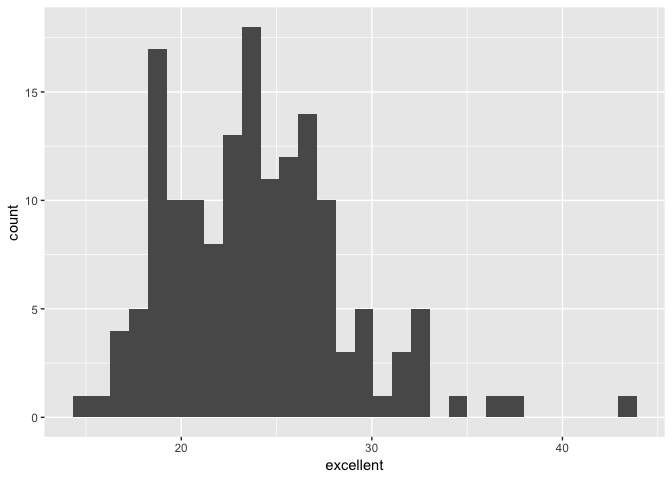

p8105\_hw2\_sc4456
================
Siyan Chen
9/29/2018

Problem 1
=========

``` r
NYC_transit_data_modified = read_csv("./hw2_data/NYC_Transit_Subway_Entrance_And_Exit_Data.csv") %>% 
  janitor::clean_names() %>% 
  select(line, station_name, station_latitude, station_longitude, route1:route11, entry, vending, entrance_type, ada) %>% 
  mutate(entry = recode(entry, `YES`= "TRUE", `NO` = "FALSE" )) 
```

    ## Parsed with column specification:
    ## cols(
    ##   .default = col_character(),
    ##   `Station Latitude` = col_double(),
    ##   `Station Longitude` = col_double(),
    ##   Route8 = col_integer(),
    ##   Route9 = col_integer(),
    ##   Route10 = col_integer(),
    ##   Route11 = col_integer(),
    ##   ADA = col_logical(),
    ##   `Free Crossover` = col_logical(),
    ##   `Entrance Latitude` = col_double(),
    ##   `Entrance Longitude` = col_double()
    ## )

    ## See spec(...) for full column specifications.

``` r
NYC_transit_data_modified
```

    ## # A tibble: 1,868 x 19
    ##    line  station_name station_latitude station_longitu… route1 route2
    ##    <chr> <chr>                   <dbl>            <dbl> <chr>  <chr> 
    ##  1 4 Av… 25th St                  40.7            -74.0 R      <NA>  
    ##  2 4 Av… 25th St                  40.7            -74.0 R      <NA>  
    ##  3 4 Av… 36th St                  40.7            -74.0 N      R     
    ##  4 4 Av… 36th St                  40.7            -74.0 N      R     
    ##  5 4 Av… 36th St                  40.7            -74.0 N      R     
    ##  6 4 Av… 45th St                  40.6            -74.0 R      <NA>  
    ##  7 4 Av… 45th St                  40.6            -74.0 R      <NA>  
    ##  8 4 Av… 45th St                  40.6            -74.0 R      <NA>  
    ##  9 4 Av… 45th St                  40.6            -74.0 R      <NA>  
    ## 10 4 Av… 53rd St                  40.6            -74.0 R      <NA>  
    ## # ... with 1,858 more rows, and 13 more variables: route3 <chr>,
    ## #   route4 <chr>, route5 <chr>, route6 <chr>, route7 <chr>, route8 <int>,
    ## #   route9 <int>, route10 <int>, route11 <int>, entry <chr>,
    ## #   vending <chr>, entrance_type <chr>, ada <lgl>

-   The new dataset contains viables of line, station name, station latitude, station longitue, 1 to 11 routs served, entry, vending, entrance type and ADA notes. For the data cleaning steps, I import the original dataset and modify the variable names and then use select function to retain the variables I interested. The new dataset gives the 1868 rows and 19. This is not tidy data.

``` r
distinct(NYC_transit_data_modified,station_name,line) %>% 
  nrow()
```

    ## [1] 465

``` r
# Firstly, I use distinct function to find the distinct station which excludes the repeated stations. Then, I use nrow function to fund the number of distinct stations 
NYC_transit_data_modified %>% 
  filter(ada == "TRUE") %>% 
  distinct(station_name,line) %>% 
  nrow()
```

    ## [1] 84

``` r
# This is to get the anwser of how many stations are ADA complaint. Firstly, I removed the NA data of ADA notes.Then I use distinct function to found our how many distinct stations exist because some ADA compliants target the same station. It returns the 84 stations are ADA compliant. 
```

-   There are 465 distinct stations

-   There are 84 stations are ADA compliant.

``` r
NYC_transit_data_modified %>% 
filter(vending == "YES") %>% 
  nrow()/nrow(NYC_transit_data_modified)
```

    ## [1] 0.9020343

-   What proportion of station entrances / exits without vending allow entrance? It returns 90.2% station entrances/exits without vending allow entrance.

``` r
NYC_transit_data_modified %>% 
  gather(., key = "route_number", value = "route_name", 5:15) %>% 
  filter(., route_name == "A") %>% 
  distinct(., station_name, line) %>% 
  nrow() 
```

    ## [1] 60

``` r
NYC_transit_data_modified
```

    ## # A tibble: 1,868 x 19
    ##    line  station_name station_latitude station_longitu… route1 route2
    ##    <chr> <chr>                   <dbl>            <dbl> <chr>  <chr> 
    ##  1 4 Av… 25th St                  40.7            -74.0 R      <NA>  
    ##  2 4 Av… 25th St                  40.7            -74.0 R      <NA>  
    ##  3 4 Av… 36th St                  40.7            -74.0 N      R     
    ##  4 4 Av… 36th St                  40.7            -74.0 N      R     
    ##  5 4 Av… 36th St                  40.7            -74.0 N      R     
    ##  6 4 Av… 45th St                  40.6            -74.0 R      <NA>  
    ##  7 4 Av… 45th St                  40.6            -74.0 R      <NA>  
    ##  8 4 Av… 45th St                  40.6            -74.0 R      <NA>  
    ##  9 4 Av… 45th St                  40.6            -74.0 R      <NA>  
    ## 10 4 Av… 53rd St                  40.6            -74.0 R      <NA>  
    ## # ... with 1,858 more rows, and 13 more variables: route3 <chr>,
    ## #   route4 <chr>, route5 <chr>, route6 <chr>, route7 <chr>, route8 <int>,
    ## #   route9 <int>, route10 <int>, route11 <int>, entry <chr>,
    ## #   vending <chr>, entrance_type <chr>, ada <lgl>

``` r
# I use gather function to reformat date from wide to long. To get the number of distinct stations serving A train, I filter the data to only keep the rows with A trains. Then I use previous method to get the number of distinct stations, which returns 60. 
```

``` r
NYC_transit_data_modified %>% 
  gather(., key = "route_number", value = "route_name", 5:15) %>% 
  filter(., route_name == "A") %>% 
  filter(ada == "TRUE") %>% 
  distinct(., station_name, line) %>% 
  nrow() 
```

    ## [1] 17

``` r
# Use filter function to firstly keep the row with A train and use filter function again to keep the row with ada complaints. It returns 17.
```

-   There are 56 distinct stations serve the A train.Of the stations that serve the A train, there are 17 have ADA complaint.

Problem 2
=========

``` r
trashwheel_data = readxl::read_xlsx("./hw2_data/HealthyHarborWaterWheelTotals2018-7-28.xlsx", sheet = "Mr. Trash Wheel") %>% 
  janitor::clean_names() %>% 
  select(-x_1) %>% 
  filter(!is.na(dumpster)) %>% 
  mutate(sports_balls = as.integer(round(sports_balls)))
trashwheel_data
```

    ## # A tibble: 285 x 14
    ##    dumpster month  year date                weight_tons volume_cubic_ya…
    ##       <dbl> <chr> <dbl> <dttm>                    <dbl>            <dbl>
    ##  1        1 May    2014 2014-05-16 00:00:00        4.31               18
    ##  2        2 May    2014 2014-05-16 00:00:00        2.74               13
    ##  3        3 May    2014 2014-05-16 00:00:00        3.45               15
    ##  4        4 May    2014 2014-05-17 00:00:00        3.1                15
    ##  5        5 May    2014 2014-05-17 00:00:00        4.06               18
    ##  6        6 May    2014 2014-05-20 00:00:00        2.71               13
    ##  7        7 May    2014 2014-05-21 00:00:00        1.91                8
    ##  8        8 May    2014 2014-05-28 00:00:00        3.7                16
    ##  9        9 June   2014 2014-06-05 00:00:00        2.52               14
    ## 10       10 June   2014 2014-06-11 00:00:00        3.76               18
    ## # ... with 275 more rows, and 8 more variables: plastic_bottles <dbl>,
    ## #   polystyrene <dbl>, cigarette_butts <dbl>, glass_bottles <dbl>,
    ## #   grocery_bags <dbl>, chip_bags <dbl>, sports_balls <int>,
    ## #   homes_powered <dbl>

``` r
precipitation2016 = readxl::read_xlsx("./hw2_data/HealthyHarborWaterWheelTotals2018-7-28.xlsx", sheet = "2016 Precipitation", range = "A2:B14") %>% 
  janitor::clean_names() %>% 
  filter(!is.na(total)) %>% 
  mutate(year = "2016") %>% 
  select(year, everything())
  
precipitation2017 = readxl::read_xlsx("./hw2_data/HealthyHarborWaterWheelTotals2018-7-28.xlsx", sheet = "2017 Precipitation", range = "A2:B14")%>% 
  janitor::clean_names() %>% 
  filter(!is.na(total)) %>% 
  mutate(year = "2017") %>% 
  select(year, everything()) 

precipitation_tidy = bind_rows(precipitation2016, precipitation2017) %>%   
  mutate(month = month.name[month]) 
precipitation_tidy
```

    ## # A tibble: 24 x 3
    ##    year  month     total
    ##    <chr> <chr>     <dbl>
    ##  1 2016  January    3.23
    ##  2 2016  February   5.32
    ##  3 2016  March      2.24
    ##  4 2016  April      1.78
    ##  5 2016  May        5.19
    ##  6 2016  June       3.2 
    ##  7 2016  July       6.09
    ##  8 2016  August     3.96
    ##  9 2016  September  4.53
    ## 10 2016  October    0.62
    ## # ... with 14 more rows

There are 12 observations in 2016 and 12 observation in 2017. The Key Variable includs year, month and total precipitation. The total precipitation in 2017 is 32.93 in. The median number of sports balls in a dumpster is 8

Problem 3
=========

``` r
devtools::install_github("p8105/p8105.datasets")
```

    ## Skipping install of 'p8105.datasets' from a github remote, the SHA1 (21f5ad1c) has not changed since last install.
    ##   Use `force = TRUE` to force installation

``` r
library(p8105.datasets)
data(brfss_smart2010)
modified_brfss =
brfss_smart2010 %>% 
janitor::clean_names() %>% 
filter(topic == "Overall Health") %>% 
select(-class, -topic, -question, -sample_size, -confidence_limit_low : -geo_location) %>% 
spread(response, data_value) %>% 
janitor::clean_names() %>% 
mutate(excellent_or_very_good = excellent + very_good) 
```

``` r
modified_brfss %>% 
  distinct(locationdesc) %>% 
  nrow()
```

    ## [1] 404

``` r
# It returns the 404 unique locations
modified_brfss %>% 
  distinct(locationabbr) %>% 
  nrow()
```

    ## [1] 51

``` r
# It returns 51 states, so every state is representated
names(which.max(table(modified_brfss$locationabbr)))
```

    ## [1] "NJ"

``` r
# This method is what I found on google. I am trying to understand how it works. I guess it first help to fing the maximum occuring character and gives the name of the character. I guess the reason to use table function is that which.max function only works for table. It returns NJ.
```

-   There are and there are 51 distinct states, so every state is represented. NJ state is observed the most
-   The median of Excellent value is 22
-   Histogram

``` r
modified_brfss_2002 = filter(modified_brfss, year == "2002")
# get the data of year of 2002
ggplot(modified_brfss_2002, aes(x = excellent)) + geom_histogram()
```

    ## `stat_bin()` using `bins = 30`. Pick better value with `binwidth`.

    ## Warning: Removed 2 rows containing non-finite values (stat_bin).

 \* Scatterplot

``` r
newyork_county_queens_county_data = filter(modified_brfss, locationdesc == "NY - Queens County" | locationdesc =="NY - New York County")
# get the data of New York county and Queens county
ggplot(newyork_county_queens_county_data, aes(x = year, y = excellent))+geom_point(aes(color = locationdesc))
```


